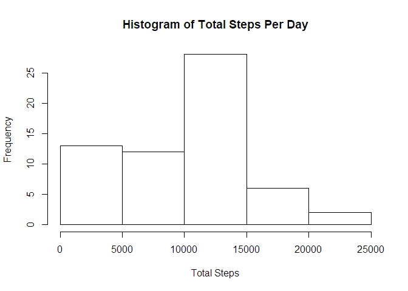
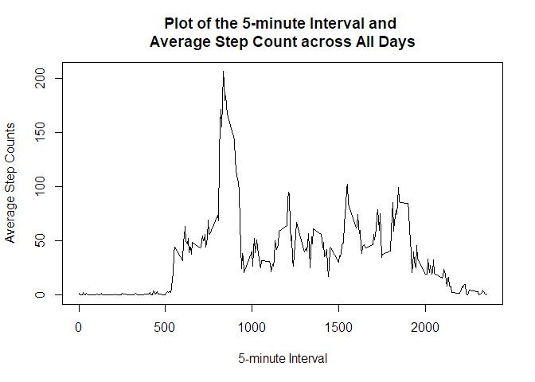
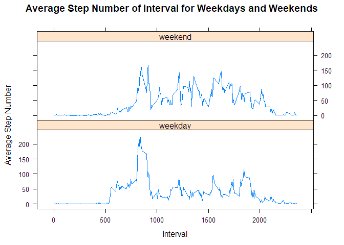

# Reproducible Research: Peer Assessment 1


## Loading and preprocessing the data

Load the data.


```r
## Check if csv data exists.
if (!file.exists("activity.csv")) {
    ## If not, unzip it.
    unzip("activity.zip")
}
## Load the data.
activity <- read.csv("activity.csv")
```

Some simple preprocessing.


```r
activity$date <- as.Date(activity$date)
activity$interval <- as.factor(activity$interval)
```

A simple description of data.


```r
str(activity)
```

```
## 'data.frame':	17568 obs. of  3 variables:
##  $ steps   : int  NA NA NA NA NA NA NA NA NA NA ...
##  $ date    : Date, format: "2012-10-01" "2012-10-01" ...
##  $ interval: Factor w/ 288 levels "0","5","10","15",..: 1 2 3 4 5 6 7 8 9 10 ...
```

## What is mean total number of steps taken per day?

Calculate the total number of steps taken per day, ignoring NAs.


```r
total <- aggregate(activity$steps, list(date = activity$date), sum, na.rm = TRUE)
```

Make a histogram of the total number of steps taken per day.


```r
hist(total$x, xlab = "Total Steps", main = "Histogram of Total Steps Per Day")
```

<!-- -->

Calculate the mean and median of the total number of steps taken per day.


```r
total_mean <- mean(total$x)
total_median <- median(total$x)
```

The mean of the total number of steps taken per day: 9354.2295082.

The median of the total number of steps taken per day: 10395.

## What is the average daily activity pattern?

Plot about 5-minute interval and average steps across all days.


```r
pattern <- aggregate(activity$steps, list(interval = activity$interval), mean, na.rm = TRUE)
plot(pattern$interval, pattern$x, type = 'l', xlab = "5-minute Interval", ylab = "Average Step Counts", main = "Plot of the 5-minute Interval and \nAverage Step Count across All Days")
```

<!-- -->

Find the 5-minute interval with the maximum number of average steps.


```r
max_interval <- pattern$interval[which.max(pattern$x)]
```

The 5-minute interval **835** contains the maximum number of average steps.

## Imputing missing values

Note that there are a number of days/intervals where there are missing values (coded as NA). The presence of missing days may introduce bias into some calculations or summaries of the data.

Check the number of missing values.


```r
nas <- is.na(activity)
sum(nas)
```

```
## [1] 2304
```

So we have **2304** missing values.

Strategy for filling in all missing values: Use the **mean** for that 5-minute interval.

Create a new dataset that is equal to the original one but with NAs all filled in by this strategy.


```r
activity_fixed <- activity
for (i in which(nas)) {
    activity_fixed$steps[i] <- pattern$x[pattern$interval == activity_fixed$interval[i]]
}
```

Now make a histogram of the total number of steps taken each day.


```r
total_fixed <- aggregate(activity_fixed$steps, list(date = activity_fixed$date), sum)
hist(total$x, xlab = "Total Steps", main = "Histogram of Total Steps Per Day")
```

<!-- -->

Calculate the mean and median of the total number of steps taken per day.


```r
total_mean_fixed <- mean(total_fixed$x)
total_median_fixed <- median(total_fixed$x)
```

The mean of the total number of steps taken per day: 1.0766189\times 10^{4}.

The median of the total number of steps taken per day: 1.0766189\times 10^{4}.

From the data calculated above we can see that: The median of total number steps per day is slightly different from the dataset with NAs, but the means show a larger difference. What's more, it's amazing that the mean and median are equal.

Imputing data in that way would cause increasements in both mean and median, with mean having the larger increasement.

## Are there differences in activity patterns between weekdays and weekends?

Create a new factor variable that indicates whether the day recorded is a weekday or weekend day.


```r
activity_fixed$weekends <- weekdays(activity_fixed$date) %in% c("Saturday", "Sunday")
activity_fixed$weekends <- factor(activity_fixed$weekends, labels = c("weekday", "weekend"))
```

Plot about 5-minute interval and average steps across all weekday days and weekend days.


```r
pattern_wk <- aggregate(activity_fixed$steps, list(interval = activity_fixed$interval, weekends = activity_fixed$weekends), mean)
library(lattice)
xyplot(x ~ as.integer(as.character(interval)) | weekends, data = pattern_wk, type = "l", layout = c(1, 2), xlab = "Interval", ylab = "Average Step Number", main = "Average Step Number of Interval for Weekdays and Weekends")
```

<!-- -->
